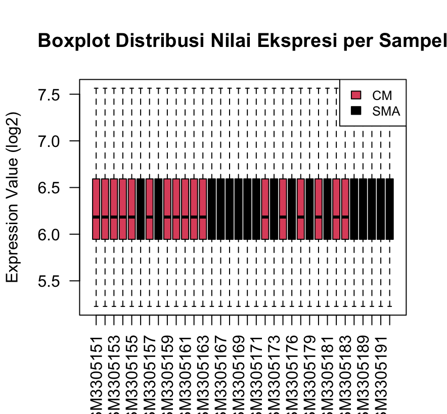
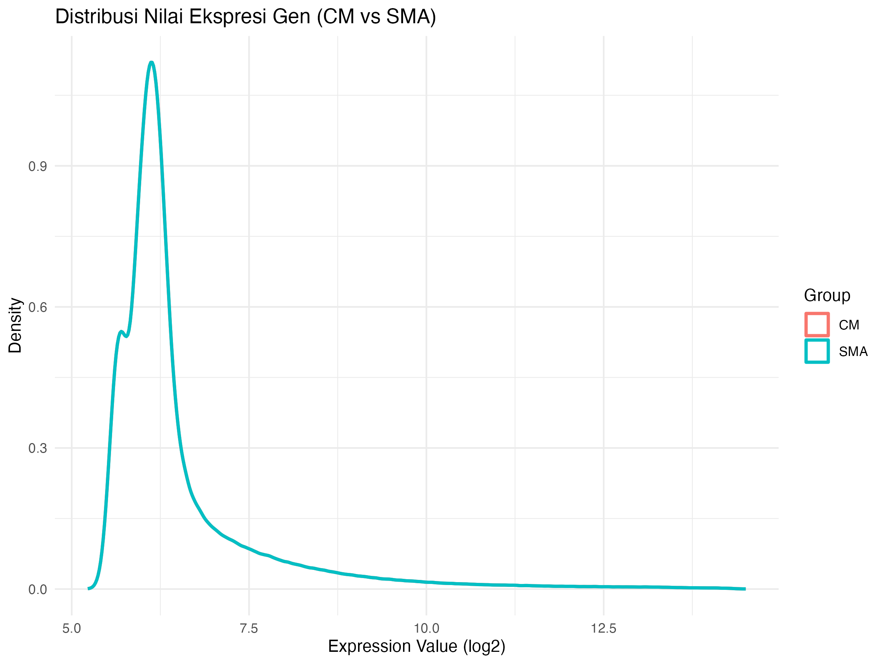
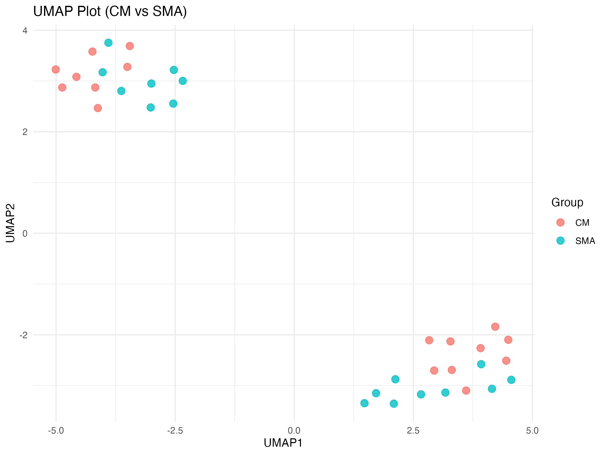
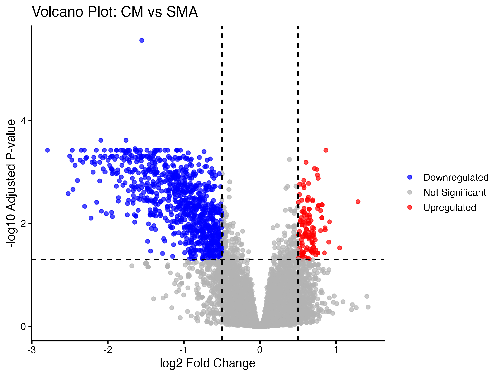
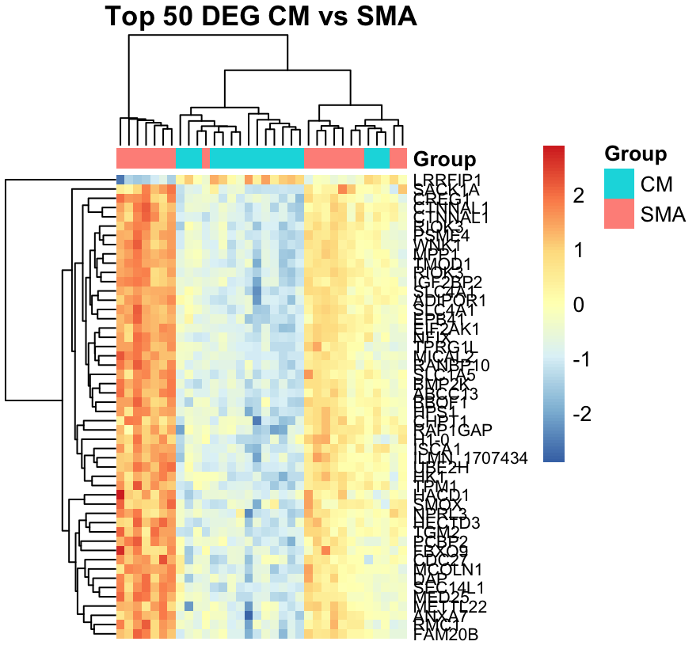
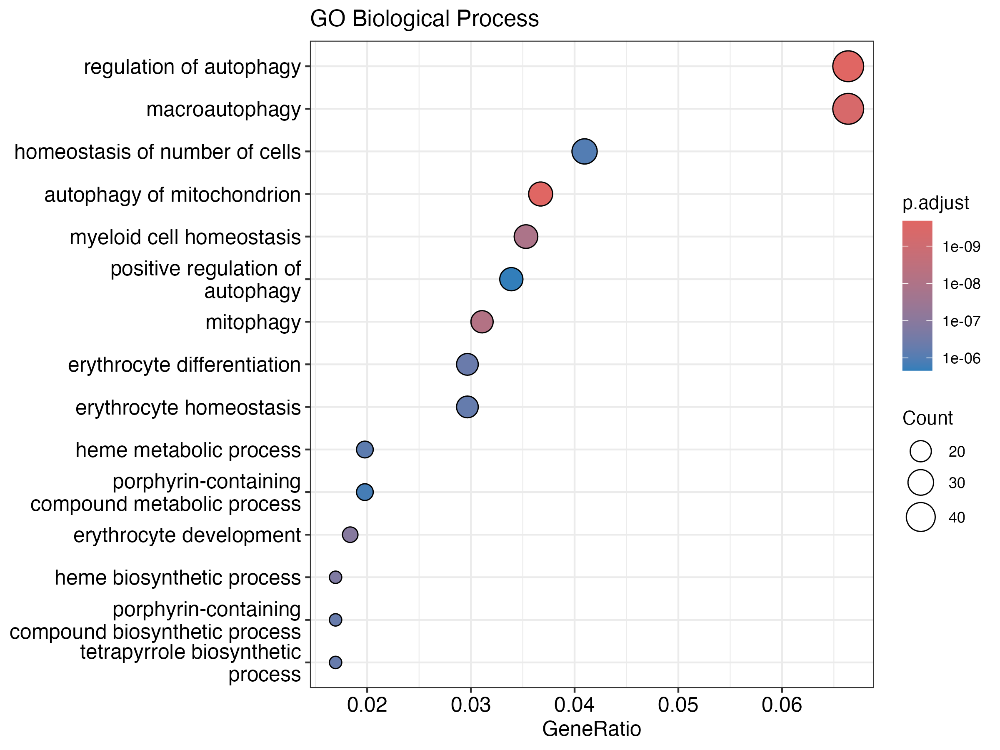
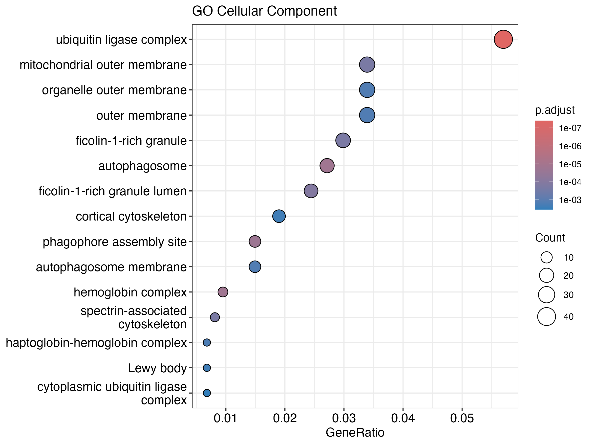
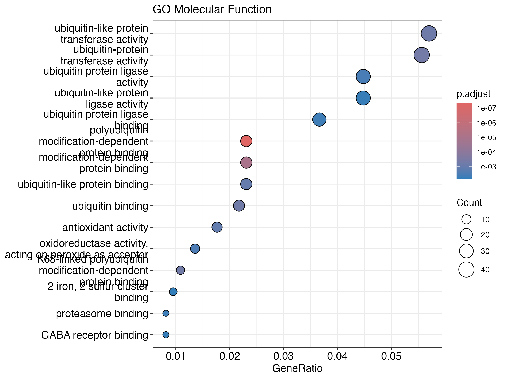
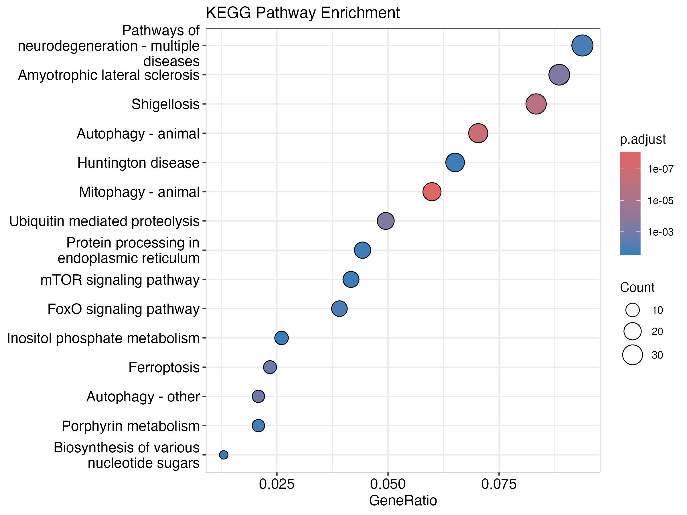

# Transcriptomics Analysis of GSE117613: Differential Gene Expression Between Cerebral Malaria and Severe Malarial Anemia

**Author:** Kiky Martha Ariesaka

**Dataset:** GSE117613

**Platform:** Illumina HumanHT-12 V4.0 Expression BeadChip

**Comparison:** Cerebral Malaria (CM) vs Severe Malarial Anemia (SMA)

---

# 1. Pendahuluan

Malaria merupakan penyakit infeksi yang disebabkan oleh *Plasmodium falciparum* dan masih menjadi salah satu penyebab utama morbiditas serta mortalitas di berbagai negara tropis. Pada kasus malaria berat, infeksi dapat berkembang menjadi berbagai manifestasi klinis, di antaranya **Cerebral Malaria (CM)** dan **Severe Malarial Anemia (SMA)**. Kedua kondisi tersebut memiliki mekanisme patogenesis yang berbeda sehingga diperkirakan memiliki profil ekspresi gen yang berbeda pula.

Analisis transcriptomics memungkinkan identifikasi perubahan ekspresi gen secara menyeluruh sehingga dapat memberikan gambaran mengenai mekanisme molekuler yang mendasari kedua manifestasi malaria berat tersebut. Selain mengidentifikasi Differentially Expressed Genes (DEGs), analisis ini juga dapat mengungkap proses biologis, fungsi molekuler, komponen seluler, serta jalur biologis yang berperan melalui analisis Gene Ontology (GO) dan Kyoto Encyclopedia of Genes and Genomes (KEGG).

Pada tugas ini digunakan dataset publik **GSE117613** yang diperoleh dari Gene Expression Omnibus (GEO). Analisis dilakukan menggunakan paket **limma** pada perangkat lunak R untuk mengidentifikasi gen yang mengalami perubahan ekspresi antara kelompok Cerebral Malaria (CM) dan Severe Malarial Anemia (SMA). Hasil analisis kemudian divisualisasikan menggunakan berbagai metode, termasuk volcano plot, heatmap, serta analisis enrichment GO dan KEGG.

---

# 2. Metode

## 2.1 Dataset

Dataset yang digunakan adalah **GSE117613** yang diunduh dari Gene Expression Omnibus (GEO). Platform yang digunakan adalah **Illumina HumanHT-12 V4.0 Expression BeadChip**. Analisis difokuskan pada dua kelompok sampel, yaitu **Cerebral Malaria (CM)** dan **Severe Malarial Anemia (SMA)**.

## 2.2 Preprocessing Data

Data ekspresi gen diunduh menggunakan paket **GEOquery**. Selanjutnya dilakukan pemeriksaan kebutuhan transformasi log2 berdasarkan distribusi nilai ekspresi. Sampel kemudian difilter sehingga hanya menyisakan kelompok CM dan SMA untuk analisis lanjutan.

## 2.3 Differential Expression Analysis

Analisis diferensial ekspresi dilakukan menggunakan paket **limma**. Design matrix dibuat berdasarkan kelompok sampel (CM dan SMA), kemudian dilakukan pembentukan contrast matrix untuk membandingkan kedua kelompok tersebut. Gen dianggap berbeda nyata apabila memenuhi kriteria:

- Adjusted p-value < 0.05
- |log2 Fold Change| > 0.5

## 2.4 Gene Annotation

Identitas probe dikonversi menjadi simbol gen menggunakan paket **illuminaHumanv4.db** sehingga setiap hasil analisis dapat diinterpretasikan pada tingkat gen.

## 2.5 Functional Enrichment Analysis

Daftar gen yang berbeda nyata dikonversi menjadi Entrez Gene ID menggunakan paket **org.Hs.eg.db**. Selanjutnya dilakukan analisis enrichment yang meliputi:

- Gene Ontology Biological Process (GO-BP)
- Gene Ontology Cellular Component (GO-CC)
- Gene Ontology Molecular Function (GO-MF)
- Kyoto Encyclopedia of Genes and Genomes (KEGG)

## 2.6 Visualisasi Data

Visualisasi dilakukan menggunakan beberapa pendekatan, yaitu:

- Boxplot distribusi ekspresi
- Density plot
- UMAP
- Volcano plot
- Heatmap Top 50 Differentially Expressed Genes
- GO enrichment dotplot
- KEGG enrichment dotplot

# 3. Hasil dan Interpretasi

## 3.1 Quality Control

### Boxplot Distribusi Nilai Ekspresi

Boxplot menunjukkan distribusi nilai ekspresi gen pada seluruh sampel setelah preprocessing. Median ekspresi antar sampel relatif seragam dengan rentang interkuartil yang hampir sama. Hasil ini menunjukkan bahwa kualitas data cukup baik dan tidak terdapat variasi teknis yang mencolok antar sampel, sehingga data layak digunakan untuk analisis diferensial ekspresi.

---

### Density Plot

Density plot memperlihatkan distribusi nilai ekspresi gen pada kelompok Cerebral Malaria (CM) dan Severe Malarial Anemia (SMA). Kurva distribusi kedua kelompok memiliki pola yang hampir identik, menunjukkan bahwa proses normalisasi berhasil mengurangi variasi teknis antar sampel sehingga perbedaan yang diamati pada analisis berikutnya lebih mungkin disebabkan oleh faktor biologis.

---

### UMAP

Visualisasi menggunakan Uniform Manifold Approximation and Projection (UMAP) menunjukkan adanya pengelompokan sampel berdasarkan profil ekspresi gen. Meskipun masih terdapat sebagian sampel yang saling tumpang tindih, distribusi kedua kelompok menunjukkan adanya pola biologis yang berbeda antara CM dan SMA. Hasil ini mengindikasikan bahwa perubahan ekspresi gen mampu membedakan karakteristik molekuler kedua manifestasi malaria berat tersebut.

---

## 3.2 Differential Expression Analysis

### Volcano Plot

Analisis diferensial ekspresi menggunakan paket **limma** menghasilkan **967 Differentially Expressed Genes (DEGs)** dengan kriteria adjusted p-value < 0.05 dan |log2 Fold Change| > 0.5.

Volcano plot menunjukkan bahwa sebagian besar gen mengalami **downregulation** pada kelompok CM dibandingkan SMA, sedangkan sejumlah gen lainnya mengalami **upregulation**. Distribusi tersebut menunjukkan adanya perubahan ekspresi gen yang cukup luas antara kedua kelompok klinis.

---

### Top 50 Differentially Expressed Genes

Heatmap dari 50 gen dengan adjusted p-value terbaik memperlihatkan pola ekspresi yang berbeda antara kelompok CM dan SMA. Analisis hierarchical clustering berhasil mengelompokkan sebagian besar sampel sesuai kelompok klinisnya, menunjukkan bahwa gen-gen tersebut memiliki kemampuan yang baik dalam membedakan kedua kondisi malaria berat.

---

## 3.3 Functional Enrichment Analysis

### Gene Ontology Biological Process (GO-BP)

Analisis GO Biological Process menunjukkan bahwa gen-gen yang mengalami perubahan ekspresi terutama berhubungan dengan **regulation of autophagy**, **macroautophagy**, **mitophagy**, **erythrocyte homeostasis**, serta **heme metabolic process**. Temuan ini menunjukkan bahwa gangguan metabolisme eritrosit dan regulasi autofagi merupakan proses biologis penting yang membedakan CM dan SMA.

---

### Gene Ontology Cellular Component (GO-CC)

Pada kategori Cellular Component, gen-gen berbeda nyata terutama diperkaya pada **ubiquitin ligase complex**, **mitochondrial outer membrane**, **autophagosome**, **ficolin-1-rich granule**, serta **hemoglobin complex**. Hasil ini menunjukkan keterlibatan organel sel, kompleks protein, dan struktur yang berkaitan dengan degradasi protein, fungsi mitokondria, serta metabolisme eritrosit.

---

### Gene Ontology Molecular Function (GO-MF)

Analisis Molecular Function menunjukkan dominasi aktivitas **ubiquitin protein ligase activity**, **ubiquitin binding**, **antioxidant activity**, serta **oxidoreductase activity**. Jalur-jalur tersebut mengindikasikan adanya perubahan regulasi degradasi protein dan respons terhadap stres oksidatif pada malaria berat.

---

### KEGG Pathway Analysis

Analisis KEGG menunjukkan beberapa jalur biologis yang mengalami pengayaan signifikan, antara lain **Autophagy**, **Mitophagy**, **mTOR signaling pathway**, **FoxO signaling pathway**, **Ferroptosis**, dan **Protein processing in endoplasmic reticulum**. Jalur-jalur tersebut berhubungan dengan homeostasis sel, respons stres, metabolisme, dan mekanisme kematian sel yang diketahui berperan dalam patogenesis malaria berat.

---

# 4. Kesimpulan

Analisis transcriptomics terhadap dataset GSE117613 berhasil mengidentifikasi **967 Differentially Expressed Genes (DEGs)** antara kelompok Cerebral Malaria (CM) dan Severe Malarial Anemia (SMA). Visualisasi menggunakan volcano plot dan heatmap menunjukkan adanya perbedaan profil ekspresi gen yang jelas antara kedua kelompok.

Analisis Gene Ontology mengidentifikasi keterlibatan proses biologis yang berkaitan dengan autofagi, metabolisme heme, homeostasis eritrosit, fungsi mitokondria, serta aktivitas ubiquitin. Selain itu, analisis KEGG menunjukkan pengayaan pada jalur autophagy, mitophagy, mTOR signaling, FoxO signaling, ferroptosis, dan protein processing in the endoplasmic reticulum.

Secara keseluruhan, hasil analisis menunjukkan bahwa perbedaan ekspresi gen antara CM dan SMA berkaitan dengan regulasi respons imun, stres oksidatif, metabolisme eritrosit, dan mekanisme homeostasis sel, sehingga memberikan gambaran molekuler mengenai patogenesis kedua manifestasi malaria berat tersebut.